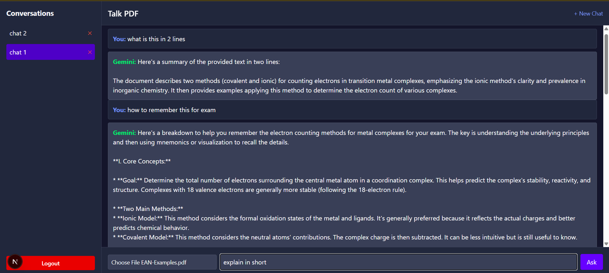
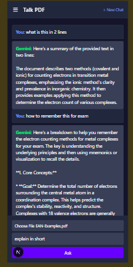
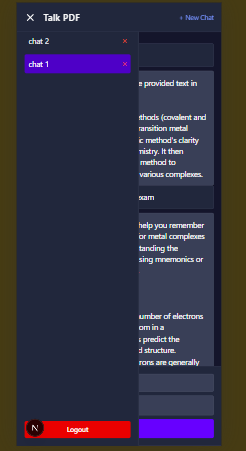

# Talk PDF 📄💬

Talk PDF is a responsive web app that allows users to upload PDF documents and chat with them using the Gemini API. Built with Next.js 13+, Tailwind CSS, and supports multi-conversation history with a sleek, dark mode UI.

## 🌐 Live Demo
https://talk-pdf-seven.vercel.app/login


## 🚀 Features

- 📁 Upload PDF files
- 💬 Chat with your PDF using Gemini API
- 💡 Multi-conversation sidebar with history
- 🌓 Dark mode interface
- 📱 Responsive layout
- 🔐 Authentication and logout

## 🛠️ Tech Stack

- **Next.js 13+** (App Router)
- **Tailwind CSS**
- **Gemini API (Google AI)**
- **Supabase** for authentication and data storage
- **PostgreSQL** for storing chat history

## 🧑‍💻 Setup Instructions

1. **Clone the Repository**

```
git clone https://github.com/IrfanHussain25/talk-pdf.git
cd talk-pdf
```

2. **Install Dependencies**

```
npm install
Environment Setup
```

3. **Create a .env.local file:**

```
NEXT_PUBLIC_SUPABASE_URL=your_supabase_url
NEXT_PUBLIC_SUPABASE_ANON_KEY=your_supabase_anon_key
GEMINI_API_KEY=your_gemini_api_key
```

4. **Run the Development Server**

```
npm run dev
The app should be running at http://localhost:3000
```


## 📸 Screenshots
### Desktop Interface


### Mobile Interface 1


### Mobile Interface 2



## 🤝 Contributing
Pull requests are welcome. For major changes, please open an issue first.
